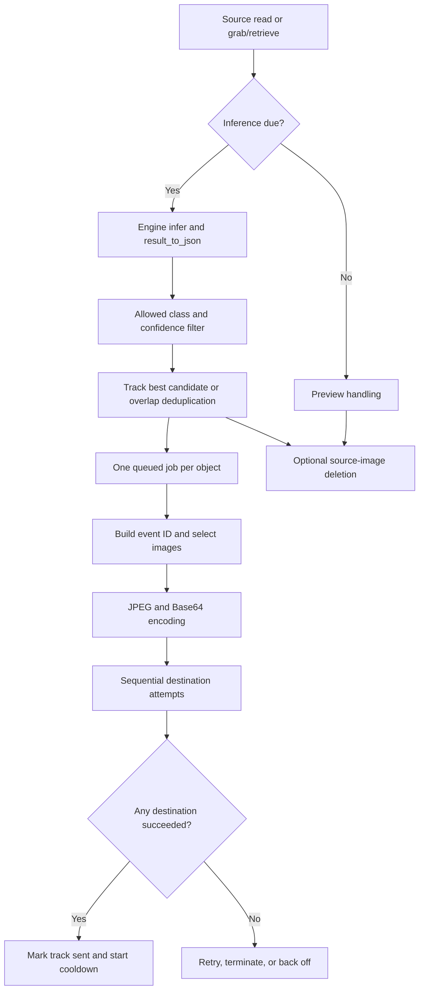

# Detection and webhook code review

Reviewed 2026-09-14 against workspace commit `5530ff8` and the rebuilt VMS container. This is a sender-side code review, with synthetic reproductions and local HTTP stub tests. It is not a camera load test or a review of the external receiver. No production configuration or application code was changed.

**Assessment**

The code has useful performance improvements, but event correctness is the first priority. Capture, inference, candidate selection, delivery, and cleanup do not yet share a consistent event lifecycle. The most consequential gaps are engine output incompatibility, file inputs being sampled like video, incomplete delivery accounting, and candidates disappearing during termination or recovery.

**Actual path**

The main pipeline uses `ResultPublisher.publish_sync()` from its own background worker. The older `ResultPublisher.publish()` executor and destination-level outbound deque are separate paths; their queue characteristics should not be attributed to the main pipeline.

**New findings from the deeper pass**

| Priority | Finding and trigger | Evidence and impact | Fix direction |
|---|---|---|---|
| High | Folder inputs inherit the inference FPS gate. | `pipeline.py:1274` and `1386`: two folder images arriving inside one sampling interval produced one inference but two calls to the deletion hook. The installed folder reader advances its index for each image. With auto-delete enabled, an image can be consumed and deleted without analysis. | Define separate source policies: analyze each file once; sample continuous video. Delete files only under an explicit completion policy. |
| High | Candidate expiry can discard a detection ready for delivery. | `pipeline.py:334`, `1338`: cleanup precedes collection. A candidate older than `MAX_COLLECT_SECONDS + TRACK_LOST_TIMEOUT_SECONDS + 5` is deleted. A synthetic 11-second stall removed a ready candidate without incrementing dropped events. This requires cleanup to be due on recovery. | Promote ready candidates before expiry; record every deliberate discard. |
| High | Candidate timers depend on new inference results. | `pipeline.py:1335`: ready-track collection is inside `if results is not None`. An empty folder, blocked camera, or engine repeatedly returning `None` does not advance delivery of an already selected candidate merely because its deadline elapsed. | Run candidate deadlines independently of successful capture/inference. |
| High, affected engines | Engine output contracts are inconsistent beyond ONNX. | `simple_custom_engine.py:207` returns a JSON string even for `output_format='dict'`; it is not excluded by builtin discovery. `geti_engine.py:191` wraps a serialized prediction object under `predictions`, rather than converting it to the list the pipeline iterates. A representative GETI `model_dump()` fixture produced a dict whose iteration yields strings. Both forms conflict with downstream `.get()` usage. | Validate and normalize engine output at the adapter boundary. Treat the simple custom implementation as an unfinished example, not a working detection engine. Test GETI against a real SDK prediction fixture before enabling it. |
| Medium | Successful tracker fallback is not remembered. | `ultralytics_engine.py:564`: the successful name is assigned to local `tracker_used`, never `self.tracker`. Two synthetic inferences retried the same failing primary and first fallback before succeeding with ByteTrack each time. | Retain a successful fallback and report the effective tracker. Validate tracker continuity during a switch. |
| Medium | Payload node identity is actually pipeline identity. | `pipeline.py:395`: both `node_id` and `pipeline_id` are assigned `self.id`; the manager sets that ID to the pipeline ID. Reproduced identical fields. | Carry the actual worker/node ID separately if the receiver uses this field as node identity. Confirm compatibility before changing the payload. |

The six diagnostic tests are in [detection_webhook_diagnostics.py](detection_webhook_diagnostics.py). They deliberately assert existing problematic behavior; a passing diagnostic means the issue was reproduced, not that the behavior is correct. The folder test intercepts deletion rather than deleting files. GETI is checked with a representative serialized object, not a live deployment.

**Previously reproduced issues, consolidated**

| Area | Finding | Source |
|---|---|---|
| Delivery state | A terminal failure clears the pending marker without recording suppression; the next detection can recreate the rejected track. Existing termination tests stop before that next detection. | `InferenceNode/pipeline.py:555` |
| Multiple destinations | Any successful destination ends job retries and starts cooldown, even when the webhook failed. Counters describe success as delivery via webhook regardless of which destination succeeded. This is an explicit current policy, but not an all-destinations delivery guarantee. | `ResultPublisher/publisher.py:252`; `InferenceNode/pipeline.py:523` |
| Model startup | `configure()` ignores a false model-load result and still marks initialization successful. | `InferenceNode/pipeline.py:1505` |
| ONNX | Generic `OnnxEngine` produces `top_class`, `top_score`, and center-format boxes; the pipeline expects `class_name`, `confidence`, and corner-format overlap calculations. Current filtering drops these predictions. Fixing field names alone would leave the box-format problem. | `InferenceEngine/engines/onnx_engine.py:291`; `InferenceNode/pipeline.py:1353` |
| Natural termination | `run()` stops the source but does not stop the publisher worker or flush candidate state. The manager then removes runtime references. A worker remained alive after synthetic EOF. | `InferenceNode/pipeline.py:1395`; `InferenceNode/pipeline_manager.py:1270` |
| Explicit shutdown | An empty queue does not mean no delivery is in flight. Drain logic can exit early, and its short worker join does not guarantee an HTTP request has finished. | `InferenceNode/pipeline.py:1634` |
| Duplicate selection | Movement with the same tracker ID can trigger the ID-reuse heuristic and bypass cooldown. This is a heuristic tradeoff, not proof of a new person. | `InferenceNode/pipeline.py:239` |
| Untracked failures | Untracked detections become eligible immediately after failure; the tracked-object backoff is not applied to them. | `InferenceNode/pipeline.py:555` |
| Image requirements | If `imencode` returns false, a destination requesting images may still receive metadata and return success. | `ResultPublisher/publisher.py:187` |
| Numeric validation | Non-finite values pass the comparison-based validation. A NaN FPS value suppressed subsequent inference in a reproduction. | `InferenceNode/pipeline.py:1467` |
| Long outage | `2 ** attempts` is evaluated before applying the reconnect cap. Attempt 1024 produced `OverflowError`. The outage duration depends on connection/read blocking time. | `InferenceNode/pipeline.py:1038` |

**Frame fidelity, queueing, and durability**

- The selected original frame matches its best detection, but the annotated image comes from `_latest_frame` at delivery time (`pipeline.py:439`). It can represent another moment. Capture image, annotations, capture timestamp, and frame identity should travel together.
- Best selection means highest detection confidence. It does not rank face sharpness, pose, visibility, or face size. Whether extra scoring helps requires receiver-specific evaluation.
- Events are per object, not per frame. Multiple objects can retain separate full-frame copies and upload the same scene repeatedly. The default 1000-job queue could hold about 5.8 GiB of raw 1080p BGR arrays per pipeline before other state, when each job owns a separate image.
- Queue-full handling waits up to one second per job on the inference thread (`pipeline.py:372`). The normal network path is asynchronous; the overload path can still stall capture.
- Encoding occurs inside every `publish_sync` call, before destination eligibility checks. Retry and local rate-limit polling therefore repeat JPEG/Base64 work. Encode once per event and reuse it across attempts, with explicit image requirements.
- One worker handles jobs serially; retry waits block following jobs. A queue bounded by both bytes and age would make overload behavior clearer. Any concurrency change must preserve per-destination rate limits and event identity.
- Queued jobs, candidates, and cooldown records are process memory. Database-backed pipeline configuration does not make pending deliveries durable. A restart can lose unsent events and reset duplicate suppression. A durable outbox is needed only if eventual delivery across restarts is a requirement.
- HTTP 2xx means accepted according to the sender's status policy; it does not prove downstream recognition completed. `event_id` is stable across attempts for a job, but timestamps are stamped per attempt. Actual receiver deduplication was not examined.

**Capture and observability limits**

The installed `framesource/sources/ipcamera_capture.py` opens `cv2.VideoCapture(stream_url)` without explicit application-supplied open/read deadlines. It calls `CAP_PROP_BUFFERSIZE=1` but ignores the setter result. The configured camera FPS is informational. These observations do not establish which settings the current backend honors or what timeout it defaults to; a controlled RTSP test is required.

Capture and inference still share a thread. The grab/retrieve optimization saves unnecessary conversion and copies, but it does not establish a continuously drained, independently captured latest-frame channel. Camera-to-event latency must be measured directly before claiming live-edge behavior under load.

The benchmark's capture timestamp is recorded after application read, not at camera exposure. Its `frame_age` measures recency of reads and cannot rule out buffered old video. Add capture/source timestamps where available, enqueue time, attempt start/end, payload bytes, queue age/bytes, and final per-destination disposition. Keep camera clock uncertainty explicit.

Configuration logging also deserves cleanup: `pipeline_manager.py` prints `final_frame_config`, and the installed IP-camera reader logs its authenticated stream URL on open failure. Credentials can be included if present in those values. This was identified from source; no secret values were collected for this review.

**Optimizations worth preserving**

Inference FPS gating with drift correction; eligible live-source grab/retrieve; avoiding preview copies when unused; fixed-camera BoT-SORT with motion compensation and ReID disabled; best-candidate selection and in-flight suppression; stable per-job event IDs; transport/status classification with separate backpressure accounting; bounded retry count; and nonblocking CPU/NVML telemetry are all implemented. These features should survive fixes to the surrounding lifecycle.

The older asynchronous publisher reuses a mutable payload across destinations and has an executor queue; this is separate from the main synchronous event path. Prioritize the production path, then either unify or clearly isolate the legacy path.

**Verification and gaps**

- Earlier in this review: 83 existing FPS/skip-conversion/GPU-probe tests passed; 62 webhook lifecycle/integration tests passed.
- This deeper pass: 11 existing tracker tests and 4 existing event-ID tests passed; 6 new diagnostic reproductions passed. Total across those selected checks: 166 passes, including the 6 diagnostics that confirm defects.
- Tests ran in temporary container directories with existing dependencies. HTTP tests used local stub receivers, with production webhook settings cleared or overridden in their test processes. No cameras, production database, or external webhook receiver were used.
- Test gaps: next-frame behavior after terminal rejection; all-required-destination completion; real engine-schema fixtures; source-type-specific sampling; delayed candidate delivery without new frames; restart durability; and actual camera-to-receiver load/latency.
- One older test docstring says no stable event ID exists; newer code and the event-ID suite prove otherwise. Interpret comments against executable behavior.
- Existing benchmark reports use a null destination and looped files for some runs; those numbers cannot establish webhook throughput or RTSP behavior. Performance impact estimates here are structural, not new throughput measurements.

**Suggested implementation order**

1. Normalize engine detections and reject failed model initialization. Distinguish file processing from video sampling.
2. Introduce explicit candidate/event states and per-destination completion; keep images and detection metadata immutable together.
3. Run candidate deadlines independently of incoming frames; handle EOF, reconnect, and shutdown through one cleanup path that tracks in-flight work.
4. Define deletion and restart-durability requirements; expose every lost/dropped event in counters.
5. Cache event encoding, reuse HTTP connections, share preview encoding, and bound queue memory/age.
6. Validate with real RTSP streams and an authorized test receiver, including outages, backpressure, multiple viewers, restarts, and crowded frames.

Do not change payload image size, crop semantics, or required-destination policy without checking the receiver contract. The sender-only evidence here cannot establish receiver expectations.
